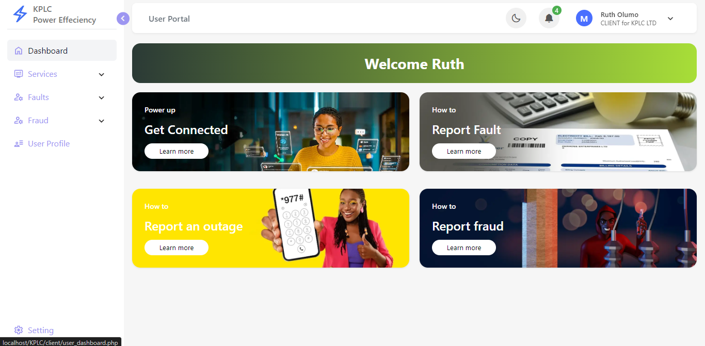
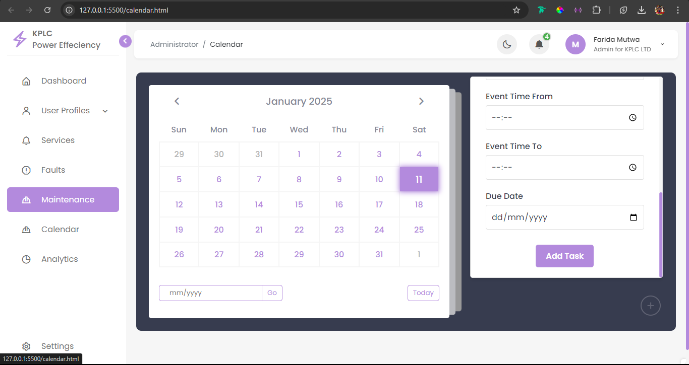
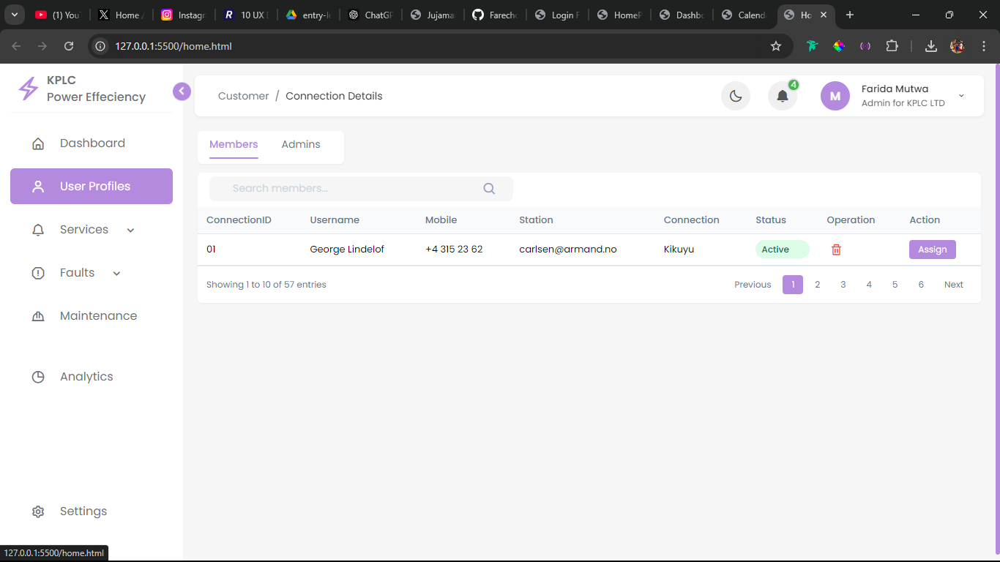

# KPLC Power Efficiency Application

## Overview

The KPLC Power Efficiency application is a comprehensive power management system designed to help administrators and users manage electrical connections, maintenance schedules, and service delivery. This web-based application provides an intuitive interface for managing power distribution and customer relationships.

## Showcased Features

### Landing Page : All Users

### Dashboard : User Dashboards

### Calendar Management System : Admin Portal

### User Management : Admin Portal

---

Note: The screenshot provided cover just a section of the entire system. Full System documentation in progress.
